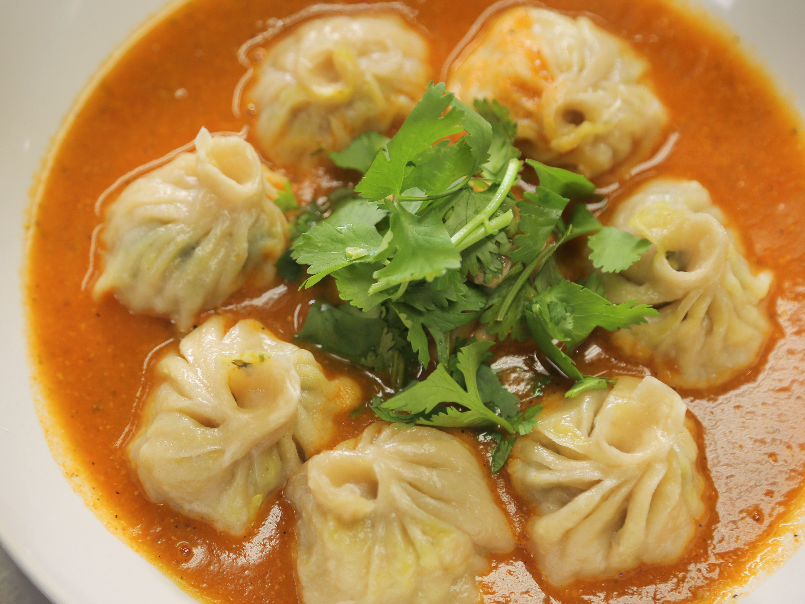

<!-- 1. Heading for Weather Forecast -->
<h1>Welcome</h1>
<!-- 
HTML inline tags
 -->

<!-- 2. Weather Forecast for Toronto -->

Weather for Today in Toronto: Clear skies with a high of 25°C.

<!-- 3. Image for Today's Toronto Weather -->

<!-- 4. HTML Comments for Logical Divisions -->
<!-- Welcome Heading -->
<!-- Weather Forecast -->
<!-- Toronto Weather Image -->

<!-- 5. Example of Inline Formatting Tags -->

<b>This</b> is an <i>example</i> with <ins>Nepali</ins> food.

<!-- 6. Example of <del> and <ins> Formatting Tags -->

Old price: <del>$20</del>, New price: <ins>$18</ins>

<!-- 7. Lists -->
<!-- Unordered List -->
<ul>
  <li>Momo</li>
  <li>Thukpa</li>
  <li>Dal Bhat</li>
</ul>

<!-- Ordered List -->
<ol>
  <li>Sel Roti</li>
  <li>Chatamari</li>
  <li>Kwati</li>
</ol>

<!-- 8. Website about Favorite Food -->
<h1>My Favorite Food: Nepali Cuisine</h1>

<!-- 9. Title and Subtitle with Images -->
<h2>Delicious Nepali Dishes</h2>

